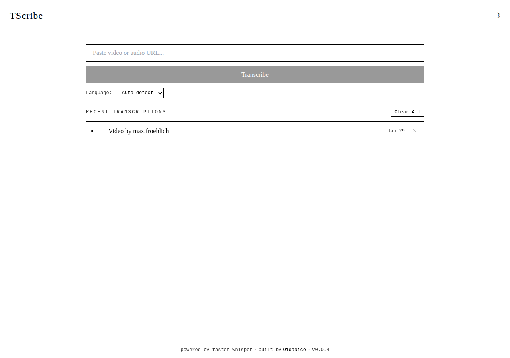
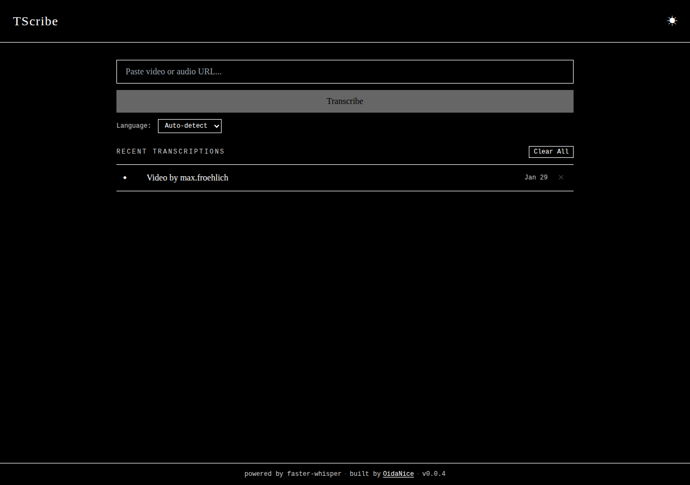
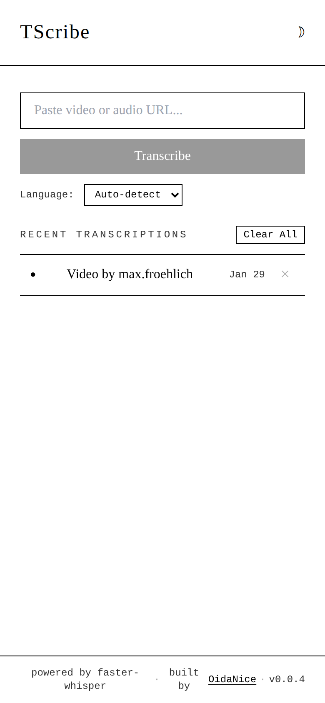

# OidaNice TScribe

<p align="center">
  
</p>

<p align="center">
  <strong>Self-hosted video &amp; audio transcription.</strong><br>
  Paste a URL, get a transcript.
</p>

<p align="center">
  <!-- Custom SVG badges matching the Kindle monochrome aesthetic -->
  
  
  
  
  
</p>

---

## Features

- **Subtitle-first pipeline** -- fetches existing platform subtitles in ~3 seconds, falls back to Whisper AI only when needed
- **1000+ supported sites** -- YouTube, TikTok, Instagram, Facebook, X/Twitter, and everything else yt-dlp supports
- **Kindle-inspired UI** -- monochrome design with dark mode, serif typography, no distractions
- **Installable PWA** -- add to home screen on mobile with browser-specific install prompts
- **One-command setup** -- Docker Compose brings up all four services in seconds
- **Export formats** -- SRT, VTT, TXT, JSON with one-click download
- **Tunnel-ready** -- works behind Cloudflare Tunnel or any reverse proxy out of the box

---

## Screenshots

<!-- Replace these with actual screenshots of your deployment -->

| Light Mode | Dark Mode |
|:---:|:---:|
|  |  |

| Mobile | PWA Install |
|:---:|:---:|
|  |  |

> To add screenshots: create `docs/screenshots/` and place your images there.

---

## Quick Start

```bash
git clone https://github.com/LL4nc33/oidanice-tscribe.git
cd oidanice-tscribe
cp .env.example .env
docker compose up -d
```

Open [http://localhost:3001](http://localhost:3001) and paste a video URL.

---

## System Requirements

### Minimum (CPU-only, subtitle-first)

| Resource | Requirement |
|----------|-------------|
| CPU | 2 cores |
| RAM | 2 GB |
| Disk | 5 GB free |
| OS | Linux, macOS, or Windows (Docker Desktop) |
| Software | Docker 20+, Docker Compose v2 |

> With the subtitle-first pipeline, most YouTube/TikTok videos are transcribed in ~3 seconds without any Whisper processing. CPU-only is perfectly usable for subtitle-fetching and short audio clips.

### Recommended (Whisper transcription)

| Resource | Requirement |
|----------|-------------|
| CPU | 4+ cores |
| RAM | 4 GB (8 GB for `large-v3` model) |
| Disk | 10 GB free |
| GPU | NVIDIA with 4+ GB VRAM (optional, 10-50x faster) |
| Software | Docker 20+, Docker Compose v2, nvidia-container-toolkit (for GPU) |

### Optimal (Production, GPU)

| Resource | Requirement |
|----------|-------------|
| CPU | 4+ cores |
| RAM | 8+ GB |
| Disk | 20 GB SSD |
| GPU | NVIDIA RTX 3060+ with 6+ GB VRAM |
| Software | Docker 20+, nvidia-container-toolkit |
| Network | Stable internet for media downloads |

> GPU transcription with `large-v3` model processes a 1-hour video in ~2 minutes. CPU with `base` model takes ~15-30 minutes for the same content.

---

## Architecture

```
┌─────────────────────────────────────────────────┐
│  Browser / PWA                                  │
└──────────────────────┬──────────────────────────┘
                       │
                       ▼
┌──────────────────────────────────────────────────┐
│  nginx (frontend :3001)                          │
│  ├── Static files (React SPA)                    │
│  └── /api/* reverse proxy ───┐                   │
└──────────────────────────────┼───────────────────┘
                               │
                               ▼
┌──────────────────────────────────────────────────┐
│  FastAPI (api :8000)                             │
│  ├── Job CRUD endpoints                          │
│  ├── SQLite persistence                          │
│  └── Redis job enqueue ──────┐                   │
└──────────────────────────────┼───────────────────┘
                               │
                               ▼
┌──────────────────────────────────────────────────┐
│  Redis Queue (:6379, password-protected)         │
└──────────────────────┬───────────────────────────┘
                       │
                       ▼
┌──────────────────────────────────────────────────┐
│  Worker                                          │
│  ├── Phase 0: Fetch platform subtitles (~3s)     │
│  ├── Phase 1: Download audio via yt-dlp          │
│  ├── Phase 2: Transcribe via faster-whisper      │
│  └── Phase 3: Cleanup temp files                 │
└──────────────────────────────────────────────────┘
```

| Service | Image | Purpose |
|---------|-------|---------|
| **frontend** | nginx-unprivileged:alpine | React SPA + API reverse proxy |
| **api** | python:3.12-slim | REST API, job management, SQLite |
| **worker** | python:3.12-slim | Media download + transcription |
| **redis** | redis:7-alpine | Job queue backend (password-protected) |

**Data flow:** URL submitted → API creates job in SQLite → enqueued in Redis → Worker tries subtitle fetch first (fast path) → falls back to audio download + Whisper → results saved to DB → available for export.

---

## Configuration

Copy `.env.example` to `.env` and adjust as needed. All backend settings use the `TSCRIBE_` prefix.

| Variable | Default | Description |
|----------|---------|-------------|
| `TSCRIBE_DEBUG` | `false` | Enable debug mode |
| `TSCRIBE_LOG_LEVEL` | `INFO` | Log level: DEBUG, INFO, WARNING, ERROR |
| `TSCRIBE_CORS_ORIGINS` | `["*"]` | Allowed CORS origins. Wildcard is safe (no cookie auth). |
| `TSCRIBE_DATABASE_URL` | `sqlite+aiosqlite:////data/tscribe.db` | Database connection |
| `TSCRIBE_REDIS_URL` | `redis://:...@redis:6379/0` | Redis URL (set by Compose) |
| `REDIS_PASSWORD` | `tscribe-redis-secret` | Redis password |
| `TSCRIBE_WHISPER_MODEL` | `base` | Model size (see table below) |
| `TSCRIBE_WHISPER_DEVICE` | `auto` | Device: `auto`, `cpu`, `cuda` |
| `TSCRIBE_WHISPER_COMPUTE_TYPE` | `int8` | Quantization: `int8`, `float16`, `float32` |
| `TSCRIBE_JOB_TIMEOUT_SECONDS` | `7200` | Max job duration (2 hours) |
| `TSCRIBE_CLEANUP_MAX_AGE_HOURS` | `24` | Auto-cleanup age for temp files |

### Whisper Models

| Model | VRAM | Relative Speed | Accuracy | Recommendation |
|-------|------|----------------|----------|----------------|
| `tiny` | ~1 GB | 10x | Basic | Testing only |
| `base` | ~1 GB | 7x | Good | **Default** -- best speed/quality balance |
| `small` | ~2 GB | 4x | Better | Good on modern CPUs |
| `medium` | ~5 GB | 2x | High | GPU recommended |
| `large-v3` | ~6 GB | 1x | Highest | Best quality, GPU required |

---

## GPU Support

For NVIDIA GPU acceleration (10-50x faster transcription):

1. Install [NVIDIA Container Toolkit](https://docs.nvidia.com/datacenter/cloud-native/container-toolkit/latest/install-guide.html)
2. Uncomment the `deploy` section in `docker-compose.yml`:

```yaml
worker:
  deploy:
    resources:
      reservations:
        devices:
          - driver: nvidia
            count: all
            capabilities: [gpu]
```

3. Set compute type in `.env`:
```bash
TSCRIBE_WHISPER_COMPUTE_TYPE=float16
TSCRIBE_WHISPER_MODEL=large-v3  # optional: best quality
```

4. Rebuild: `docker compose up -d --build`

---

## Reverse Proxy / Cloudflare Tunnel

TScribe works behind any reverse proxy out of the box. Proxy headers, relative API paths, and flexible CORS are all preconfigured.

**Cloudflare Tunnel (simplest):**
```bash
cloudflared tunnel --url http://localhost:3001
```

**Custom domain with restricted CORS:**
```bash
# In .env
TSCRIBE_CORS_ORIGINS=["https://tscribe.yourdomain.com"]
```

**nginx reverse proxy:**
```nginx
server {
    listen 443 ssl;
    server_name tscribe.yourdomain.com;

    location / {
        proxy_pass http://localhost:3001;
        proxy_set_header Host $host;
        proxy_set_header X-Real-IP $remote_addr;
        proxy_set_header X-Forwarded-For $proxy_add_x_forwarded_for;
        proxy_set_header X-Forwarded-Proto $scheme;
    }
}
```

---

## API Reference

| Method | Endpoint | Description |
|--------|----------|-------------|
| `POST` | `/api/jobs/` | Create transcription job (`{"url": "...", "language": "de"}`) |
| `GET` | `/api/jobs/` | List all jobs (without transcript text) |
| `GET` | `/api/jobs/{id}` | Get job with full details and transcript |
| `DELETE` | `/api/jobs/{id}` | Delete job and associated files |
| `GET` | `/api/jobs/{id}/download/{fmt}` | Download transcript (`srt`, `vtt`, `txt`, `json`) |
| `GET` | `/api/health` | Health check (returns `{"status": "ok"}`) |

**Example:**
```bash
# Submit a video
curl -X POST http://localhost:8000/api/jobs/ \
  -H "Content-Type: application/json" \
  -d '{"url": "https://www.youtube.com/watch?v=dQw4w9WgXcQ"}'

# Check status
curl http://localhost:8000/api/jobs/{id}

# Download SRT
curl -O http://localhost:8000/api/jobs/{id}/download/srt
```

---

## Development

### Backend

```bash
cd backend
python -m venv .venv && source .venv/bin/activate
pip install -r requirements.txt

uvicorn app.main:app --reload --port 8000     # API server
python run_worker.py                            # Worker (separate terminal)
```

Requires: Redis on localhost:6379, ffmpeg installed.

### Frontend

```bash
cd frontend
npm install
npm run dev    # http://localhost:5173
```

### Tests

```bash
cd backend
pip install -r requirements-test.txt
pytest -v      # 50 tests (formats, API, subtitles)
```

---

## Security

All services run as non-root users. Redis is password-protected. URLs are validated against private IP ranges (SSRF protection). Job IDs are UUID-validated. See [SECURITY.md](SECURITY.md) for full details.

For public deployments, use [Cloudflare Access](https://www.cloudflare.com/products/zero-trust/) or similar zero-trust solutions for authentication.

---

## Tech Stack

| Layer | Technology |
|-------|------------|
| Frontend | React 18, TypeScript, Vite, Tailwind CSS |
| Backend | FastAPI, SQLAlchemy, Pydantic |
| Transcription | faster-whisper (CTranslate2) |
| Media Download | yt-dlp |
| Queue | Redis 7, RQ (Redis Queue) |
| Database | SQLite (aiosqlite) |
| Infrastructure | Docker Compose, nginx |

---

## Project Structure

```
oidanice-tscribe/
├── backend/
│   ├── app/
│   │   ├── main.py              # FastAPI application
│   │   ├── config.py            # Settings (env vars)
│   │   ├── models.py            # SQLAlchemy models
│   │   ├── schemas.py           # Pydantic schemas
│   │   ├── database.py          # DB connection + migrations
│   │   ├── routes/
│   │   │   ├── jobs.py          # Job CRUD + download endpoints
│   │   │   └── health.py        # Health check
│   │   └── worker/
│   │       ├── tasks.py         # Job execution pipeline
│   │       ├── subtitles.py     # Subtitle-first fetcher
│   │       ├── download.py      # yt-dlp audio download
│   │       ├── transcribe.py    # faster-whisper wrapper
│   │       ├── shutdown.py      # Graceful SIGTERM handler
│   │       └── cleanup.py       # File cleanup sweep
│   ├── tests/                   # pytest test suite
│   ├── Dockerfile
│   ├── entrypoint.sh            # Non-root permission fix
│   └── requirements.txt
├── frontend/
│   ├── src/
│   │   ├── App.tsx              # Main application
│   │   ├── api/client.ts        # API client
│   │   ├── components/          # React components
│   │   ├── hooks/               # Custom hooks
│   │   └── types/               # TypeScript types
│   ├── public/
│   │   ├── manifest.json        # PWA manifest
│   │   ├── sw.js                # Service worker
│   │   └── favicon.svg          # Monochrome favicon
│   ├── Dockerfile
│   └── nginx.conf               # Reverse proxy config
├── docker-compose.yml
├── .env.example
├── SECURITY.md
├── CHANGELOG.md
└── README.md
```

---

Built by [OidaNice](https://github.com/LL4nc33/oidanice-tscribe) · powered by faster-whisper · v0.0.4a
